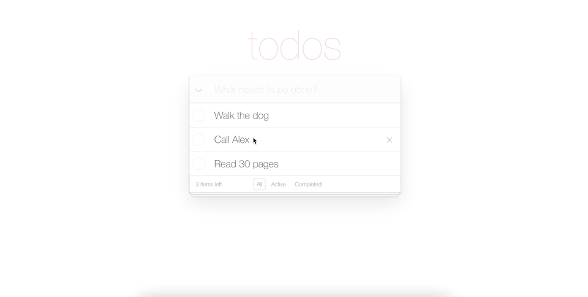

# Todo List 




🚀 **Live Demo:** [View Here](https://pogorielova.github.io/Todo-List/)

## 📌 Overview

The **Todo List** allows users to add, delete, mark tasks as completed, update the title. Users also can filter the todos by status, mark all as completed with one click, or delete all completed tasks.

## ✨ Features

- 🔹 Add task by typing the title + Enter
- 🔹 Edit the task title by clicking on the task twice
- 🔹 Status filter
- 🔹 Clear all completed tasks option
- 🔹 Toggle status for all todos with one click

## 🛠 Technologies Used

- React
- TypeScript
- Bulma
- REST API
- SASS

## 🖥️ Setup & Installation

1. Clone the repository:

```bash
git clone https://github.com/pogorielova/Todo-List
```

2. Install dependencies:

```bash
npm install
```

3. Run the project:

```bash
npm start
```